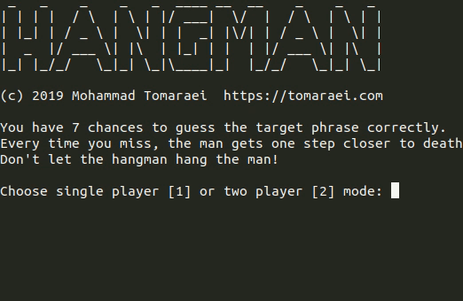

# HANGMAN
```
 _   _    _    _   _  ____ __  __    _    _   _ 
| | | |  / \  | \ | |/ ___|  \/  |  / \  | \ | |
| |_| | / _ \ |  \| | |  _| |\/| | / _ \ |  \| |
|  _  |/ ___ \| |\  | |_| | |  | |/ ___ \| |\  |
|_| |_/_/   \_|_| \_|\____|_|  |_/_/   \_|_| \_|
```
A simple game of hangman with nice ASCII visuals, written in Golang and compiled for Windows, Linux, and Mac.

## Features
* Multi-phrase targets
* Single player mode vs the computer (random phrase from a list of top phrases)
* Two player mode with a friend
* ASCII visuals
* Cross-platform

## Usage
* Download the appropriate build from the releases
* Run the executable in a terminal

## Demo

### Single Player


### Two Player
